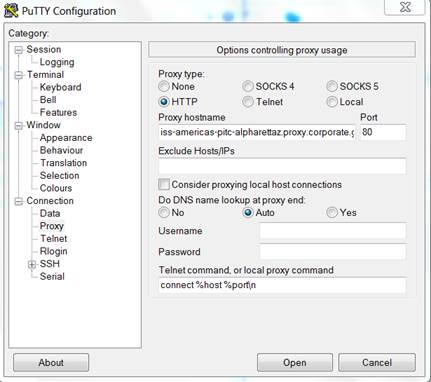

FAQ (Under Preparation)
===============================================================================

SSH to India Futuresystems from BLUESSO (GE class Only)
-------------------------------------------------------------------------------

Everything else is as usual in Putty, just need to add a proxy (see below
screenshot) under Connection>Proxy:

* Proxy type: HTTP
* Proxy hostname: iss-americas-pitc-alpharettaz.proxy.corporate.ge.com
* Port: 80
* Telnet command, or local proxy command: connect %host %port\n

virtualenv: command not found
-------------------------------------------------------------------------------

TBD

