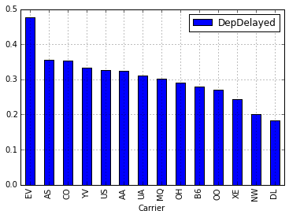

.. _ref-class-project-airline-delays:

Predicting Airline Delays with Hadoop
-------------------------------------------------------------------------------

Project Idea
^^^^^^^^^^^^^^^^^^^^^^^^^^^^^^^^^^^^^^^^^^^^^^^^^^^^^^^^^^^^^^^^^^^^^^^^^^^^^^^

One of the main goals is using machine learning algorithms to build predictive
models with Python packages and data analysis programs. Training the original
datasets is important to build models with its performance.  Finding a good
combination of technologies and programming languages would be cruicial to make
a successful project.

Project Overview
^^^^^^^^^^^^^^^^^^^^^^^^^^^^^^^^^^^^^^^^^^^^^^^^^^^^^^^^^^^^^^^^^^^^^^^^^^^^^^^

* Description: Every year approximately 20% of airline flights are delayed or
  cancelled, resulting in significant costs to both travellers and airlines.
  This project builds a supervised learning model that predicts airline delay
  from historial flight data and weather information.

.. figure:: ../images/projects/ml1.png

   Average delays by month

.. figure:: ../images/projects/ml2.png
   
   Average delays during a day

   Top 15 airlines for flight delay (Chicago O'Hare airport)

Dataset
^^^^^^^^^^^^^^^^^^^^^^^^^^^^^^^^^^^^^^^^^^^^^^^^^^^^^^^^^^^^^^^^^^^^^^^^^^^^^^^

`Airline delay dataset 2007, 2008 <http://stat-computing.org/dataexpo/2009/the-data.html>`_

Technologies
^^^^^^^^^^^^^^^^^^^^^^^^^^^^^^^^^^^^^^^^^^^^^^^^^^^^^^^^^^^^^^^^^^^^^^^^^^^^^^^

   - Hadoop
   - Apache Pig
   - Python
   - Pandas
   - HDFS
   - scikit-learn

Source 
^^^^^^^^^^^^^^^^^^^^^^^^^^^^^^^^^^^^^^^^^^^^^^^^^^^^^^^^^^^^^^^^^^^^^^^^^^^^^^^

http://nbviewer.ipython.org/github/ofermend/IPython-notebooks/blob/master/blog-part-1.ipynb

